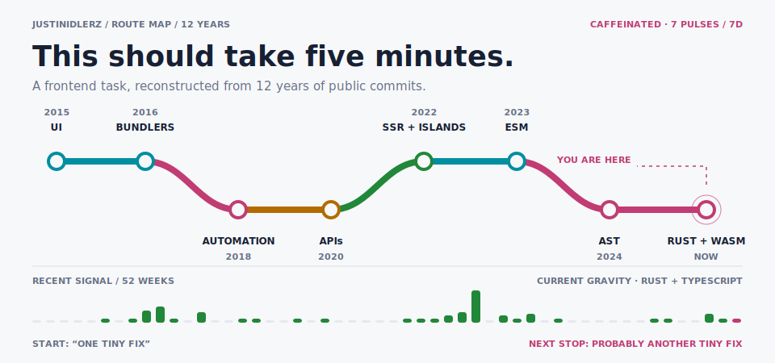

<p align="center">
  <picture>
    <source media="(prefers-color-scheme: dark)" srcset="./assets/banner-dark.svg">
    <source media="(prefers-color-scheme: light)" srcset="./assets/banner-light.svg">
    
  </picture>
</p>

<p align="center">
  <b>👋 I'm Idler. I write frontend code and keep falling through the floor.</b><br>
  <sub>Usually the floor is a bundler. Sometimes it's a parser. Lately it's Rust.</sub>
</p>

<p align="center">
  <a href="https://idler.me">🌐 idler.me</a>
  &nbsp;·&nbsp;
  <a href="mailto:zqc.sunny@gmail.com">✉️ say hi</a>
  &nbsp;·&nbsp;
  📍 Shenzhen
</p>

<p align="center">
  🔍 read the source &nbsp;·&nbsp;
  ⚡ keep it small &nbsp;·&nbsp;
  🧩 don't break users &nbsp;·&nbsp;
  🤖 automate the boring part
</p>

<details>
  <summary><b>🕳️ What happens after five minutes?</b></summary>
  <br>

```text
fix the UI
    ↓
inspect one suspicious import
    ↓
open the bundler
    ↓
read the parser
    ↓
well... hello, Rust
```

I like small tools, boring releases, compatible migrations, and questions
that begin with “wait, what actually runs?”

</details>

<p align="center">
  <sub>The route is historical. The signal strip wakes up every morning at 09:17 (UTC+8).</sub>
</p>
